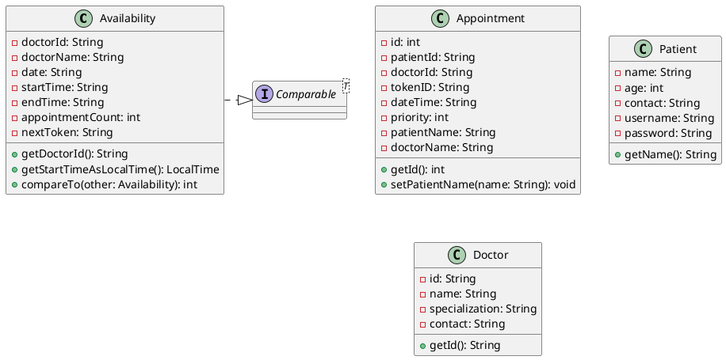
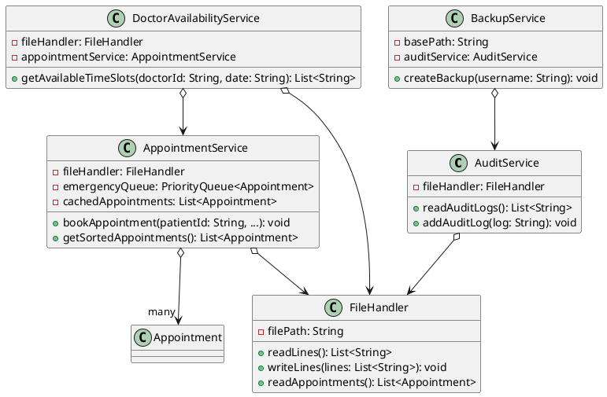

# Medical Appointment Scheduling System

## Overview

The **Medical Appointment Scheduling System** is a web-based application developed as a first-year, second-semester group project. Built using **Java Servlets**, **JSP**, and **Maven**, it demonstrates core programming concepts including **Object-Oriented Programming (OOP)**, **priority queues** for emergency scheduling, and **bubble sort** for appointment ordering. The system uses **plain text files** for data persistence to emphasize file handling skills, avoiding the complexity of a database.

### Key Features
- **Role-Based Access**:
  - **Patients**: Register, book, view, and cancel appointments.
  - **Admins**: Manage appointments, doctors, patients, and schedules.
  - **Doctors**: Access a placeholder dashboard (login not implemented).
- **Appointment Management**: Create, update, and cancel appointments with emergency prioritization using `PriorityQueue`.
- **Doctor Availability**: Admins configure schedules; patients view available slots.
- **File-Based Storage**: Stores data in `.txt` files (patients, doctors, appointments, etc.).
- **Sorting**: Implements bubble sort to order appointments by date and time.
- **Audit Logging**: Tracks system actions for administrative oversight.

### Project Objectives
- Apply **OOP principles** (Encapsulation, Abstraction, Inheritance, Polymorphism).
- Implement **priority queues** for efficient emergency appointment handling.
- Use **bubble sort** for appointment sorting (academic requirement).
- Demonstrate **file handling** for CRUD operations without a database.

---

## Technologies
- **Backend**: Java 22.0.2, Jakarta Servlet API
- **Frontend**: JSP, HTML, CSS, JavaScript (AJAX)
- **Build Tool**: Maven
- **Server**: Apache Tomcat 10.1.39
- **Libraries**:
  - Gson 2.10.1 (JSON handling)
  - Jakarta Servlet JSP JSTL API 2.0.0
  - JUnit 3.8.1 (testing)
- **Storage**: Plain text files (`.txt`)

---

## Project Structure

```
MedicalAppointmentSystem/
├── src/
│   ├── main/
│   │   ├── java/
│   │   │   ├── model/
│   │   │   │   ├── Availability.java          # Doctor availability slots
│   │   │   │   ├── Appointment.java           # Appointment details
│   │   │   │   ├── Patient.java               # Patient data
│   │   │   │   ├── Doctor.java                # Doctor data
│   │   │   ├── service/
│   │   │   │   ├── AuditService.java          # Audit logging
│   │   │   │   ├── AppointmentService.java    # Appointment management
│   │   │   │   ├── BackupService.java         # Backup functionality
│   │   │   │   ├── DoctorAvailabilityService.java # Doctor slot management
│   │   │   │   ├── FileHandler.java           # File I/O operations
│   │   │   ├── controller/
│   │   │   │   ├── AdminServlet.java          # Admin dashboard
│   │   │   │   ├── DataManagementServlet.java # Backup and logs
│   │   │   │   ├── DoctorServlet.java         # Doctor dashboard
│   │   │   │   ├── DoctorScheduleServlet.java # Schedule management
│   │   │   │   ├── LoginServlet.java          # User login
│   │   │   │   ├── LogoutServlet.java         # User logout
│   │   │   │   ├── ManageAppointmentsServlet.java # Appointment CRUD
│   │   │   │   ├── ManageDoctorsServlet.java  # Doctor CRUD
│   │   │   │   ├── ManagePatientsServlet.java # Patient CRUD
│   │   │   │   ├── RegisterServlet.java       # Patient registration
│   │   │   │   ├── SortServlet.java           # Availability sorting
│   │   │   │   ├── UserServlet.java           # Patient dashboard
│   │   ├── webapp/
│   │   │   ├── pages/
│   │   │   │   ├── adminDashboard/
│   │   │   │   │   ├── adminDashboard.jsp     # Admin dashboard
│   │   │   │   │   ├── doctorSchedule.jsp     # Schedule management
│   │   │   │   │   ├── manageDoctors.jsp      # Doctor management
│   │   │   │   │   ├── managePatients.jsp     # Patient management
│   │   │   │   │   ├── dataManagement.jsp     # Backup and logs
│   │   │   │   │   ├── manageAppointments.jsp # Appointment management
│   │   │   │   ├── doctorProfile/
│   │   │   │   │   ├── doctorDashboard.jsp    # Doctor dashboard
│   │   │   │   │   ├── appointments.jsp       # Doctor appointments
│   │   │   │   │   ├── details.jsp            # Doctor details
│   │   │   │   ├── userProfile/
│   │   │   │   │   ├── userDashboard.jsp      # Patient dashboard
│   │   │   │   │   ├── appointments.jsp       # Patient appointments
│   │   │   │   │   ├── bookAppointment.jsp    # Booking section
│   │   │   │   │   ├── userDetails.jsp        # Patient details
│   │   │   │   ├── index.jsp                  # Home page
│   │   │   │   ├── login.jsp                  # Login page
│   │   │   │   ├── register.jsp               # Registration page
│   │   │   │   ├── error.jsp                  # Error page
│   │   │   ├── assets/
│   │   │   │   ├── css/
│   │   │   │   │   ├── adminDashboard.css     # Admin styles
│   │   │   │   │   ├── doctorDashboard.css    # Doctor styles
│   │   │   │   │   ├── index.css              # Home page styles
│   │   │   │   │   ├── login.css              # Login styles
│   │   │   │   │   ├── manageOperations.css   # Management styles
│   │   │   │   │   ├── register.css           # Registration styles
│   │   │   │   │   ├── userProfile.css        # Patient styles
│   │   │   │   ├── js/
│   │   │   │   │   ├── doctorDashboard.js     # Doctor scripts
│   │   │   │   │   ├── index.js               # Home page scripts
│   │   │   │   │   ├── userProfile.js         # Patient scripts
│   │   │   ├── data/
│   │   │   │   ├── patients.txt               # Patient records
│   │   │   │   ├── admins.txt                 # Admin records
│   │   │   │   ├── doctors.txt                # Doctor records
│   │   │   │   ├── appointments.txt           # Appointment records
│   │   │   │   ├── doctors_availability.txt   # Doctor schedules
│   │   │   │   ├── audit.txt                  # Audit logs
│   │   │   ├── WEB-INF/
│   │   │   │   ├── web.xml                    # Servlet mappings
├── target/                                        # Maven build output
├── pom.xml                                        # Maven configuration
├── README.md                                      # This file
├── .gitignore                                     # Git ignore rules
```

---

## System Architecture

The application follows the **Model-View-Controller (MVC)** pattern:
- **Model**: Represents data entities (`Appointment`, `Patient`, `Doctor`, `Availability`).
- **View**: JSP pages for user interfaces (`adminDashboard.jsp`, `userDashboard.jsp`, etc.).
- **Controller**: Servlets handle HTTP requests and coordinate with services (`AdminServlet`, `UserServlet`, etc.).

### Data Flow
1. **Frontend**: JSP pages send HTTP requests to servlets.
2. **Controller**: Servlets process requests and invoke service-layer logic.
3. **Service**: Services (e.g., `AppointmentService`) manage business logic and interact with `FileHandler` for file I/O.
4. **Storage**: Data is read from and written to `.txt` files in the `data/` directory.

### Example Workflow: Booking an Appointment
1. A patient logs in via `LoginServlet`, validated against `patients.txt`.
2. The patient navigates to `bookAppointment.jsp` and selects a slot using `SortServlet`.
3. The booking request is processed by `UserServlet`, which calls `AppointmentService.bookAppointment()`.
4. `AppointmentService` uses a `PriorityQueue` to prioritize emergency appointments and updates `appointments.txt`.
5. Admins view sorted appointments (via bubble sort) on `manageAppointments.jsp`.

---

## Setup Instructions

### Prerequisites
- **Java**: JDK 22.0.2
- **Maven**: 3.8.x or higher
- **Servlet Container**: Apache Tomcat 10.1.39

### Installation Steps
1. **Clone the Repository**:
   ```bash
   git clone <repository-url>
   cd MedicalAppointmentSystem
   ```

2. **Configure Dependencies**:
   Ensure `pom.xml` includes the following:
   ```xml
   <dependencies>
       <dependency>
           <groupId>jakarta.servlet.jsp.jstl</groupId>
           <artifactId>jakarta.servlet.jsp.jstl-api</artifactId>
           <version>2.0.0</version>
       </dependency>
       <dependency>
           <groupId>org.glassfish.web</groupId>
           <artifactId>jakarta.servlet.jsp.jstl</artifactId>
           <version>2.0.0</version>
       </dependency>
       <dependency>
           <groupId>junit</groupId>
           <artifactId>junit</artifactId>
           <version>3.8.1</version>
           <scope>test</scope>
       </dependency>
       <dependency>
           <groupId>com.google.code.gson</groupId>
           <artifactId>gson</artifactId>
           <version>2.10.1</version>
       </dependency>
   </dependencies>
   ```
   Install dependencies:
   ```bash
   mvn clean install
   ```

3. **Deploy to Tomcat**:
  - Copy `target/MedicalAppointmentSystem.war` to `<tomcat-dir>/webapps/`.
  - Start Tomcat:
    ```bash
    <tomcat-dir>/bin/startup.sh  # Linux/Mac
    <tomcat-dir>/bin/startup.bat # Windows
    ```

4. **Access the Application**:
  - Open: `http://localhost:8080/MedicalAppointmentSystem`

5. **Initialize Data**:
   Populate the `data/` directory with initial files:
  - `patients.txt`: Format: `username,password,name,email,phone,dob`
  - `admins.txt`: Default: `admin,admin123`
  - `doctors.txt`: Format: `username,password,name,specialization,email,phone`
  - `appointments.txt`: Initially empty
  - `doctors_availability.txt`: Initially empty
  - `audit.txt`: Initially empty

---

## Usage

- **Patients**:
  - Register: `/pages/register.jsp`
  - Login: `/pages/login.jsp`
  - Book/View Appointments: `/pages/userProfile/userDashboard.jsp`
- **Admins**:
  - Login: `/pages/login.jsp` (e.g., `admin/admin123`)
  - Manage System: `/pages/adminDashboard/adminDashboard.jsp`
- **Doctors**:
  - View Dashboard: `/pages/doctorProfile/doctorDashboard.jsp` (no login implemented)

---

## OOP Implementation

The project emphasizes **OOP principles** across its layers:

### Model Layer
- **Availability**:
  - **Encapsulation**: Private fields with getters; selective setters.
  - **Abstraction**: Simplifies time slot management.
  - **Inheritance**: Implements `Comparable<Availability>` for sorting.
  - **Polymorphism**: Custom `compareTo` for availability sorting.
- **Appointment**, **Patient**, **Doctor**:
  - **Encapsulation**: Private fields with getters/setters.
  - **Abstraction**: Represents core entities.
  - **Inheritance**: Extends `Object`.
  - **Polymorphism**: Minimal usage.

### Service Layer
- **AuditService**, **BackupService**, **DoctorAvailabilityService**, **FileHandler**:
  - **Encapsulation**: Private fields and methods.
  - **Abstraction**: Handles specific business logic.
  - **Inheritance**: Extends `Object`.
  - **Polymorphism**: None.
- **AppointmentService**:
  - **Encapsulation**: Private fields for data management.
  - **Abstraction**: Manages appointment logic with sorting and prioritization.
  - **Inheritance**: Extends `Object`.
  - **Polymorphism**: Uses `PriorityQueue` for emergency handling.

### Controller Layer
- **Servlets** (e.g., `AdminServlet`, `UserServlet`, etc.):
  - **Encapsulation**: Private fields for services and handlers.
  - **Abstraction**: Manages HTTP request/response flow.
  - **Inheritance**: Extends `HttpServlet`.
  - **Polymorphism**: Limited to `Comparable` in `SortServlet`.

**Summary**: The system demonstrates strong encapsulation and abstraction, with inheritance primarily in controllers (`HttpServlet`) and limited polymorphism (`Comparable`, `PriorityQueue`).

---

## Class Diagrams

Visualize the system's structure using the following **PlantUML** diagrams:

### Model Package


### Service Package


### Controller Package

```plantuml
@startuml
class AdminServlet {
  -appointmentService: AppointmentService
  -availabilityService: DoctorAvailabilityService
  -doctorFileHandler: FileHandler
  -patientFileHandler: FileHandler
  +doGet(request: HttpServletRequest, response: HttpServletResponse): void
}

class DataManagementServlet {
  -auditService: AuditService
  -backupService: BackupService
  +doGet(request: HttpServletRequest, response: HttpServletResponse): void
}

class DoctorServlet {
  -appointmentService: AppointmentService
  -availabilityService: DoctorAvailabilityService
  -doctorFileHandler: FileHandler
  +doGet(request: HttpServletRequest, response: HttpServletResponse): void
}

class DoctorScheduleServlet {
  -availabilityFileHandler: FileHandler
  -doctorFileHandler: FileHandler
  +doPost(request: HttpServletRequest, response: HttpServletResponse): void
}

class LoginServlet {
  +doPost(request: HttpServletRequest, response: HttpServletResponse): void
}

class LogoutServlet {
  +doPost(request: HttpServletRequest, response: HttpServletResponse): void
}

class ManageAppointmentsServlet {
  -appointmentService: AppointmentService
  -availabilityService: DoctorAvailabilityService
  +doPost(request: HttpServletRequest, response: HttpServletResponse): void
}

class ManageDoctorsServlet {
  -doctorFileHandler: FileHandler
  +doPost(request: HttpServletRequest, response: HttpServletResponse): void
}

class ManagePatientsServlet {
  -patientFileHandler: FileHandler
  +doPost(request: HttpServletRequest, response: HttpServletResponse): void
}

class RegisterServlet {
  -patientFileHandler: FileHandler
  +doPost(request: HttpServletRequest, response: HttpServletResponse): void
}

class SortServlet {
  -appointmentService: AppointmentService
  +doGet(request: HttpServletRequest, response: HttpServletResponse): void
}

class UserServlet {
  -appointmentService: AppointmentService
  -availabilityService: DoctorAvailabilityService
  -doctorFileHandler: FileHandler
  -userFileHandler: FileHandler
  +doPost(request: HttpServletRequest, response: HttpServletResponse): void
}

class HttpServlet {
  +doGet(request: HttpServletRequest, response: HttpServletResponse): void
  +doPost(request: HttpServletRequest, response: HttpServletResponse): void
}

AdminServlet -|> HttpServlet
DataManagementServlet -|> HttpServlet
DoctorServlet -|> HttpServlet
DoctorScheduleServlet -|> HttpServlet
LoginServlet -|> HttpServlet
LogoutServlet -|> HttpServlet
ManageAppointmentsServlet -|> HttpServlet
ManageDoctorsServlet -|> HttpServlet
ManagePatientsServlet -|> HttpServlet
RegisterServlet -|> HttpServlet
SortServlet -|> HttpServlet
UserServlet -|> HttpServlet

AdminServlet o--> AppointmentService
AdminServlet o--> DoctorAvailabilityService
AdminServlet o--> FileHandler
DataManagementServlet o--> AuditService
DataManagementServlet o--> BackupService
DoctorServlet o--> AppointmentService
DoctorServlet o--> DoctorAvailabilityService
DoctorServlet o--> FileHandler
DoctorScheduleServlet o--> FileHandler
ManageAppointmentsServlet o--> AppointmentService
ManageAppointmentsServlet o--> DoctorAvailabilityService
ManageDoctorsServlet o--> FileHandler
ManagePatientsServlet o--> FileHandler
RegisterServlet o--> FileHandler
SortServlet o--> AppointmentService
UserServlet o--> AppointmentService
UserServlet o--> DoctorAvailabilityService
UserServlet o--> FileHandler
@enduml
```


To render these diagrams, use a **PlantUML** tool (e.g., [PlantUML Web Server](http://www.plantuml.com/plantuml)).

---

## Technical Highlights

- **Priority Queues**:
  - `AppointmentService` leverages `PriorityQueue` to prioritize emergency appointments (priority=1).
- **Bubble Sort**:
  - Implemented in `AppointmentService` for sorting appointments by date and time:
    ```java
    public List<Appointment> getSortedAppointments() {
        List<Appointment> list = getAllAppointments();
        for (int i = 0; i < list.size() - 1; i++) {
            for (int j = 0; j < list.size() - i - 1; j++) {
                LocalDateTime time1 = LocalDateTime.parse(list.get(j).getDateTime(), DATE_TIME_FORMATTER);
                LocalDateTime time2 = LocalDateTime.parse(list.get(j + 1).getDateTime(), DATE_TIME_FORMATTER);
                if (time1.isAfter(time2)) {
                    Appointment temp = list.get(j);
                    list.set(j, list.get(j + 1));
                    list.set(j + 1, temp);
                }
            }
        }
        return list;
    }
    ```
- **File Handling**:
  - `FileHandler` abstracts CRUD operations for `.txt` files, ensuring data persistence.

---

## Limitations
- **Security**: Passwords stored in plain text, lacking encryption.
- **Scalability**: File-based storage is inefficient for large datasets.
- **Doctor Functionality**: Limited to a placeholder dashboard without login capabilities.

---

## Future Enhancements
- Implement secure password storage using BCrypt or similar.
- Transition to a lightweight database like SQLite for improved scalability.
- Develop full doctor role functionality, including login and dashboard features.
- Enhance the UI with real-time updates using WebSockets or modern JavaScript frameworks.

---

## Contributors
- Hasitha Erandika
- Ashen Geeth
- Thilina Senevirathne
- Kaushalya Alwis
- Abhishek Bogahawaththa
- Maleesha Wickramaarachchi

---

## License
This project is intended for educational purposes only and is not licensed for commercial use.