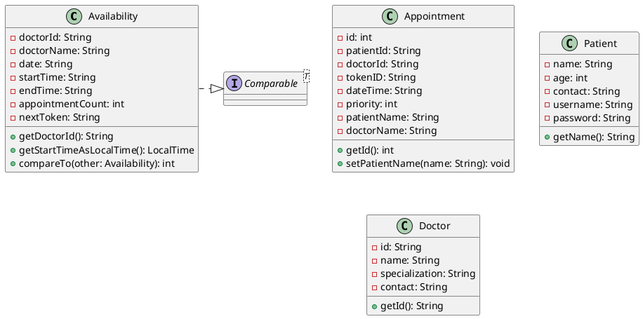
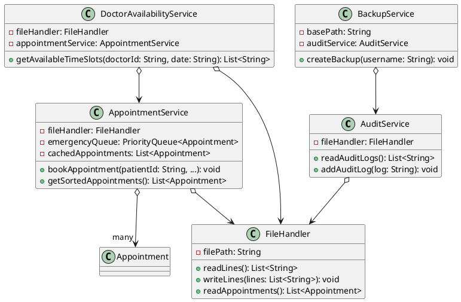

---

# Medical Appointment Scheduling System

## Overview

The **Medical Appointment Scheduling System** is a web-based application developed as a 1st-year, 2nd-semester group project using Java Servlets and JSPs. It showcases fundamental programming concepts like **OOP principles**, **priority queues** for emergency scheduling, and **bubble sort** for ordering appointments. Instead of a database, it uses plain text files for persistence, emphasizing file handling skills.

### Key Features
- **Role-Based Access**:
    - Patients: Book and view appointments.
    - Admins: Manage system data (appointments, doctors, patients, schedules).
    - Doctors: Placeholder dashboard (no login yet).
- **Appointment Management**: Book, edit, and cancel appointments with emergency prioritization.
- **Doctor Availability**: Admins set schedules; patients see available slots.
- **File-Based Storage**: Uses `.txt` files for data (patients, doctors, appointments, etc.).
- **Sorting**: Bubble sort orders appointments by date/time.
- **Priority Queues**: `PriorityQueue` prioritizes emergency appointments.

### Project Goals
- Apply **OOP principles** (Encapsulation, Abstraction, Inheritance, Polymorphism).
- Implement **priority queues** for emergency handling.
- Use **bubble sort** for appointment ordering (academic requirement).
- Demonstrate **file handling** for CRUD operations without a database.

---

## Project Structure

```
📁 MedicalAppointmentSystem
├── 📁 src
│   ├── 📁 main
│   │   ├── 📁 java                        # Backend logic (MVC pattern)
│   │   │   ├── 📁 model                   # Data entities
│   │   │   │   ├── Availability.java     # Doctor availability slots
│   │   │   │   ├── Appointment.java      # Appointment details
│   │   │   │   ├── Patient.java          # Patient data
│   │   │   │   ├── Doctor.java           # Doctor data
│   │   │   ├── 📁 service                 # Business logic
│   │   │   │   ├── AuditService.java     # Audit logging
│   │   │   │   ├── AppointmentService.java # Appointment management with sorting
│   │   │   │   ├── BackupService.java    # Backup functionality
│   │   │   │   ├── DoctorAvailabilityService.java # Doctor slot management
│   │   │   │   ├── FileHandler.java      # File I/O operations
│   │   │   ├── 📁 controller              # Servlets for HTTP handling
│   │   │   │   ├── AdminServlet.java     # Admin dashboard
│   │   │   │   ├── DataManagementServlet.java # Backup and logs
│   │   │   │   ├── DoctorServlet.java    # Doctor dashboard
│   │   │   │   ├── DoctorScheduleServlet.java # Schedule management
│   │   │   │   ├── LoginServlet.java     # User login
│   │   │   │   ├── LogoutServlet.java    # User logout
│   │   │   │   ├── ManageAppointmentsServlet.java # Appointment CRUD
│   │   │   │   ├── ManageDoctorsServlet.java # Doctor CRUD
│   │   │   │   ├── ManagePatientsServlet.java # Patient CRUD
│   │   │   │   ├── RegisterServlet.java  # Patient registration
│   │   │   │   ├── SortServlet.java      # Availability sorting
│   │   │   │   ├── UserServlet.java      # Patient dashboard
│   │   ├── 📁 webapp                      # Frontend files
│   │   │   ├── 📁 pages                   # JSP pages
│   │   │   │   ├── 📁 adminDashboard      # Admin dashboard pages
│   │   │   │   │   ├── adminDashboard.jsp    # Admin dashboard
│   │   │   │   │   ├── doctorSchedule.jsp    # Schedule management
│   │   │   │   │   ├── manageDoctors.jsp     # Doctor management
│   │   │   │   │   ├── managePatients.jsp    # Patient management
│   │   │   │   │   ├── dataManagement.jsp    # Backup and logs
│   │   │   │   │   ├── manageAppointments.jsp # Appointment management
│   │   │   │   ├── 📁 doctorProfile       # Doctor dashboard pages
│   │   │   │   │   ├── appointments.jsp   # Doctor appointments section
│   │   │   │   │   ├── dashboard.jsp      # Doctor dashboard section
│   │   │   │   │   ├── details.jsp        # Doctor details section
│   │   │   │   │   ├── doctorDashboard.jsp # Main doctor dashboard
│   │   │   │   ├── 📁 userProfile         # Patient dashboard pages
│   │   │   │   │   ├── appointments.jsp   # Patient appointments section
│   │   │   │   │   ├── bookAppointment.jsp # Booking section
│   │   │   │   │   ├── userDetails.jsp    # Patient details section
│   │   │   │   │   ├── userDashboard.jsp  # Main patient dashboard
│   │   │   │   ├── index.jsp             # Home page
│   │   │   │   ├── login.jsp             # Login page
│   │   │   │   ├── register.jsp          # Registration page
│   │   │   │   ├── error.jsp             # Error display
│   │   │   ├── 📁 assets                  # Static files
│   │   │   │   ├── 📁 css                 # CSS styling
│   │   │   │   │   ├── adminDashboard.css # Admin dashboard styles
│   │   │   │   │   ├── doctorDashboard.css # Doctor dashboard styles
│   │   │   │   │   ├── index.css          # Home page styles
│   │   │   │   │   ├── login.css          # Login page styles
│   │   │   │   │   ├── manageOperations.css # Management page styles
│   │   │   │   │   ├── register.css       # Registration page styles
│   │   │   │   │   ├── userProfile.css    # Patient dashboard styles
│   │   │   │   ├── 📁 js                  # JavaScript
│   │   │   │   │   ├── doctorDashboard.js # Doctor dashboard scripts
│   │   │   │   │   ├── index.js           # Home page scripts
│   │   │   │   │   ├── userProfile.js     # Patient dashboard scripts
│   │   │   ├── WEB-INF
│   │   │   │   ├── web.xml               # Servlet mappings
│   │   │   ├── 📁 data                   # Text file storage
│   │   │   │   ├── patients.txt          # Patient records
│   │   │   │   ├── admins.txt            # Admin records
│   │   │   │   ├── doctors.txt           # Doctor records
│   │   │   │   ├── appointments.txt      # Appointment records
│   │   │   │   ├── doctors_availability.txt # Doctor schedules
│   │   │   │   ├── audit.txt             # Audit logs
├── 📁 target                              # Maven build output
├── 📄 pom.xml                             # Maven configuration
├── 📄 README.md                           # This file
├── 📄 .gitignore                          # Git ignore rules
```

---

## Technologies Used
- **Backend**: Java (Servlets, JDK 8+)
- **Frontend**: JSP, HTML, CSS, JavaScript (AJAX)
- **Build Tool**: Maven
- **Storage**: Plain text files (`.txt`)
- **Libraries**:
    - Gson (JSON handling)
    - Jakarta Servlet API

---

## How It Works

### User Roles and Flow
- **Patients**:
    - Register: `register.jsp` → `RegisterServlet`.
    - Login: `login.jsp` → `LoginServlet`.
    - Book Appointments: `userProfile/bookAppointment.jsp` → `UserServlet`.
    - View Appointments: `userProfile/appointments.jsp`.

- **Admins**:
    - Login: `login.jsp` → `LoginServlet` (checks `admins.txt`).
    - Dashboard: `adminDashboard/adminDashboard.jsp` → `AdminServlet`.
    - Manage Appointments: `adminDashboard/manageAppointments.jsp` → `ManageAppointmentsServlet`.
    - Manage Doctors: `adminDashboard/manageDoctors.jsp` → `ManageDoctorsServlet`.
    - Manage Patients: `adminDashboard/managePatients.jsp` → `ManagePatientsServlet`.
    - Set Schedules: `adminDashboard/doctorSchedule.jsp` → `DoctorScheduleServlet`.
    - Backups/Logs: `adminDashboard/dataManagement.jsp` → `DataManagementServlet`.

- **Doctors**:
    - Placeholder: `doctorProfile/doctorDashboard.jsp` → `DoctorServlet` (stats only).

### Data Flow
1. **Frontend**: JSPs send HTTP requests to servlets.
2. **Controller**: Servlets process requests and call services.
3. **Service**: Services (e.g., `AppointmentService`) use `FileHandler` for file I/O.
4. **Model**: Data objects (e.g., `Appointment`) are read/written to `.txt` files.

### Example: Booking an Appointment
1. Patient logs in via `LoginServlet` (validates `patients.txt`).
2. Navigates to `userProfile/bookAppointment.jsp`, selects slot via `SortServlet`.
3. Submits booking to `UserServlet` → `AppointmentService.bookAppointment()`.
4. `AppointmentService` prioritizes emergencies with `PriorityQueue` and updates `appointments.txt`.
5. Admin views sorted appointments (bubble sort) on `adminDashboard/manageAppointments.jsp`.

---

## Setup Instructions

### Prerequisites
- **Java**: JDK 8 or higher
- **Maven**: 3.x
- **Servlet Container**: Apache Tomcat 9.x

### Steps
1. **Clone the Repository**:
   ```bash
   git clone <repository-url>
   cd MedicalAppointmentSystem
   ```

2. **Install Dependencies**:
    - Update `pom.xml`:
      ```xml
      <dependencies>
         <dependency>
            <groupId>jakarta.servlet.jsp.jstl</groupId>
            <artifactId>jakarta.servlet.jsp.jstl-api</artifactId>
            <version>2.0.0</version>
         </dependency>
         <dependency>
            <groupId>org.glassfish.web</groupId>
            <artifactId>jakarta.servlet.jsp.jstl</artifactId>
            <version>2.0.0</version>
         </dependency>
         <dependency>
            <groupId>junit</groupId>
            <artifactId>junit</artifactId>
            <version>3.8.1</version>
            <scope>test</scope>
         </dependency>
         <dependency>
            <groupId>com.google.code.gson</groupId>
            <artifactId>gson</artifactId>
            <version>2.10.1</version>
         </dependency>
      </dependencies>
      ```
    - Run:
      ```bash
      mvn clean install
      ```

3. **Deploy to Tomcat**:
    - Copy `target/MedicalAppointmentSystem.war` to `Tomcat/webapps/`.
    - Start Tomcat:
      ```bash
      <tomcat-dir>/bin/startup.sh  # Linux/Mac
      <tomcat-dir>/bin/startup.bat # Windows
      ```

4. **Access the Application**:
    - Visit: `http://localhost:8080/MedicalAppointmentSystem`

5. **Initial Data**:
    - Populate `data/` files:
        - `patients.txt`: `username,password,name,email,phone,dob`
        - `admins.txt`: `admin,admin123` (default admin)
        - `doctors.txt`: `username,password,name,specialization,email,phone`
        - `appointments.txt`: (empty initially)
        - `doctors_availability.txt`: (empty initially)
        - `audit.txt`: (empty initially)

---

## Usage
- **Patient**:
    - Register: `/pages/register.jsp`
    - Login: `/pages/login.jsp`
    - Book/View: `/pages/userProfile/userDashboard.jsp`
- **Admin**:
    - Login: `/pages/login.jsp` (e.g., `admin/admin123`)
    - Manage: `/pages/adminDashboard/adminDashboard.jsp`
- **Doctor**:
    - View Stats: `/pages/doctorProfile/doctorDashboard.jsp` (no login)

---

## OOP Concepts Analysis

### Model Package
- **Availability.java**:
    - **Encapsulation**: Private fields with getters; setters for mutable fields.
    - **Abstraction**: Hides time parsing logic.
    - **Inheritance**: Implements `Comparable<Availability>`.
    - **Polymorphism**: `compareTo` for sorting.
- **Appointment.java**:
    - **Encapsulation**: Private fields with getters/setters.
    - **Abstraction**: Represents appointment data.
    - **Inheritance**: Extends `Object`.
    - **Polymorphism**: None.
- **Patient.java**:
    - **Encapsulation**: Private immutable fields with getters.
    - **Abstraction**: Patient entity.
    - **Inheritance**: Extends `Object`.
    - **Polymorphism**: None.
- **Doctor.java**:
    - **Encapsulation**: Private immutable fields with getters.
    - **Abstraction**: Doctor entity.
    - **Inheritance**: Extends `Object`.
    - **Polymorphism**: None.

### Service Package
- **AuditService.java**:
    - **Encapsulation**: Private `fileHandler`.
    - **Abstraction**: Audit log management.
    - **Inheritance**: Extends `Object`.
    - **Polymorphism**: None.
- **AppointmentService.java**:
    - **Encapsulation**: Private fields with controlled access.
    - **Abstraction**: Appointment logic with sorting/priority.
    - **Inheritance**: Extends `Object`.
    - **Polymorphism**: Uses `PriorityQueue` indirectly.
- **BackupService.java**:
    - **Encapsulation**: Private fields.
    - **Abstraction**: Backup operations.
    - **Inheritance**: Extends `Object`.
    - **Polymorphism**: None.
- **DoctorAvailabilityService.java**:
    - **Encapsulation**: Private fields.
    - **Abstraction**: Availability management.
    - **Inheritance**: Extends `Object`.
    - **Polymorphism**: None.
- **FileHandler.java**:
    - **Encapsulation**: Private `filePath`.
    - **Abstraction**: File I/O abstraction.
    - **Inheritance**: Extends `Object`.
    - **Polymorphism**: None.

### Controller Package
- **AdminServlet.java**:
    - **Encapsulation**: Private fields.
    - **Abstraction**: Admin dashboard.
    - **Inheritance**: Extends `HttpServlet`.
    - **Polymorphism**: None.
- **DataManagementServlet.java**:
    - **Encapsulation**: Private services.
    - **Abstraction**: Backup/logs.
    - **Inheritance**: Extends `HttpServlet`.
    - **Polymorphism**: None.
- **DoctorServlet.java**:
    - **Encapsulation**: Private fields.
    - **Abstraction**: Doctor dashboard.
    - **Inheritance**: Extends `HttpServlet`.
    - **Polymorphism**: None.
- **DoctorScheduleServlet.java**:
    - **Encapsulation**: Private `FileHandler`s.
    - **Abstraction**: Schedule management.
    - **Inheritance**: Extends `HttpServlet`.
    - **Polymorphism**: None.
- **LoginServlet.java**:
    - **Encapsulation**: Weak; no fields.
    - **Abstraction**: Login process.
    - **Inheritance**: Extends `HttpServlet`.
    - **Polymorphism**: None.
- **LogoutServlet.java**:
    - **Encapsulation**: None; session-based.
    - **Abstraction**: Logout process.
    - **Inheritance**: Extends `HttpServlet`.
    - **Polymorphism**: None.
- **ManageAppointmentsServlet.java**:
    - **Encapsulation**: Private fields.
    - **Abstraction**: Appointment CRUD.
    - **Inheritance**: Extends `HttpServlet`.
    - **Polymorphism**: None.
- **ManageDoctorsServlet.java**:
    - **Encapsulation**: Private `FileHandler`.
    - **Abstraction**: Doctor CRUD.
    - **Inheritance**: Extends `HttpServlet`.
    - **Polymorphism**: None.
- **ManagePatientsServlet.java**:
    - **Encapsulation**: Private `FileHandler`.
    - **Abstraction**: Patient CRUD.
    - **Inheritance**: Extends `HttpServlet`.
    - **Polymorphism**: None.
- **RegisterServlet.java**:
    - **Encapsulation**: Private `FileHandler`.
    - **Abstraction**: Registration.
    - **Inheritance**: Extends `HttpServlet`.
    - **Polymorphism**: None.
- **SortServlet.java**:
    - **Encapsulation**: Private service.
    - **Abstraction**: Availability sorting.
    - **Inheritance**: Extends `HttpServlet`.
    - **Polymorphism**: Uses `Comparable`.
- **UserServlet.java**:
    - **Encapsulation**: Private fields.
    - **Abstraction**: Patient actions.
    - **Inheritance**: Extends `HttpServlet`.
    - **Polymorphism**: None.

**OOP Summary**: Strong encapsulation and abstraction across all layers. Inheritance is prominent in controllers (`HttpServlet`) and minimal elsewhere. Polymorphism is used sparingly (`Comparable` in `Availability`, `PriorityQueue` in `AppointmentService`).

---

## Class Diagrams

### Model Package


### Service Package


### Controller Package

```plantuml
@startuml
class AdminServlet {
  -appointmentService: AppointmentService
  -availabilityService: DoctorAvailabilityService
  -doctorFileHandler: FileHandler
  -patientFileHandler: FileHandler
  +doGet(request: HttpServletRequest, response: HttpServletResponse): void
}

class DataManagementServlet {
  -auditService: AuditService
  -backupService: BackupService
  +doGet(request: HttpServletRequest, response: HttpServletResponse): void
}

class DoctorServlet {
  -appointmentService: AppointmentService
  -availabilityService: DoctorAvailabilityService
  -doctorFileHandler: FileHandler
  +doGet(request: HttpServletRequest, response: HttpServletResponse): void
}

class DoctorScheduleServlet {
  -availabilityFileHandler: FileHandler
  -doctorFileHandler: FileHandler
  +doPost(request: HttpServletRequest, response: HttpServletResponse): void
}

class LoginServlet {
  +doPost(request: HttpServletRequest, response: HttpServletResponse): void
}

class LogoutServlet {
  +doPost(request: HttpServletRequest, response: HttpServletResponse): void
}

class ManageAppointmentsServlet {
  -appointmentService: AppointmentService
  -availabilityService: DoctorAvailabilityService
  +doPost(request: HttpServletRequest, response: HttpServletResponse): void
}

class ManageDoctorsServlet {
  -doctorFileHandler: FileHandler
  +doPost(request: HttpServletRequest, response: HttpServletResponse): void
}

class ManagePatientsServlet {
  -patientFileHandler: FileHandler
  +doPost(request: HttpServletRequest, response: HttpServletResponse): void
}

class RegisterServlet {
  -patientFileHandler: FileHandler
  +doPost(request: HttpServletRequest, response: HttpServletResponse): void
}

class SortServlet {
  -appointmentService: AppointmentService
  +doGet(request: HttpServletRequest, response: HttpServletResponse): void
}

class UserServlet {
  -appointmentService: AppointmentService
  -availabilityService: DoctorAvailabilityService
  -doctorFileHandler: FileHandler
  -userFileHandler: FileHandler
  +doPost(request: HttpServletRequest, response: HttpServletResponse): void
}

class HttpServlet {
  +doGet(request: HttpServletRequest, response: HttpServletResponse): void
  +doPost(request: HttpServletRequest, response: HttpServletResponse): void
}

AdminServlet -|> HttpServlet
DataManagementServlet -|> HttpServlet
DoctorServlet -|> HttpServlet
DoctorScheduleServlet -|> HttpServlet
LoginServlet -|> HttpServlet
LogoutServlet -|> HttpServlet
ManageAppointmentsServlet -|> HttpServlet
ManageDoctorsServlet -|> HttpServlet
ManagePatientsServlet -|> HttpServlet
RegisterServlet -|> HttpServlet
SortServlet -|> HttpServlet
UserServlet -|> HttpServlet

AdminServlet o--> AppointmentService
AdminServlet o--> DoctorAvailabilityService
AdminServlet o--> FileHandler
DataManagementServlet o--> AuditService
DataManagementServlet o--> BackupService
DoctorServlet o--> AppointmentService
DoctorServlet o--> DoctorAvailabilityService
DoctorServlet o--> FileHandler
DoctorScheduleServlet o--> FileHandler
ManageAppointmentsServlet o--> AppointmentService
ManageAppointmentsServlet o--> DoctorAvailabilityService
ManageDoctorsServlet o--> FileHandler
ManagePatientsServlet o--> FileHandler
RegisterServlet o--> FileHandler
SortServlet o--> AppointmentService
UserServlet o--> AppointmentService
UserServlet o--> DoctorAvailabilityService
UserServlet o--> FileHandler
@enduml
```

- **To visualize the class diagrams, use a tool like [PlantUML](http://www.plantuml.com/plantuml) by pasting the code.**:

---

## Project Highlights
- **Priority Queues**:
    - `AppointmentService` uses `PriorityQueue` to prioritize emergencies (`priority=1`).
- **Bubble Sort**:
    - Implemented in `AppointmentService`:
      ```java
      public List<Appointment> getSortedAppointments() {
          List<Appointment> list = getAllAppointments();
          for (int i = 0; i < list.size() - 1; i++) {
              for (int j = 0; j < list.size() - i - 1; j++) {
                  LocalDateTime time1 = LocalDateTime.parse(list.get(j).getDateTime(), DATE_TIME_FORMATTER);
                  LocalDateTime time2 = LocalDateTime.parse(list.get(j + 1).getDateTime(), DATE_TIME_FORMATTER);
                  if (time1.isAfter(time2)) {
                      Appointment temp = list.get(j);
                      list.set(j, list.get(j + 1));
                      list.set(j + 1, temp);
                  }
              }
          }
          return list;
      }
      ```
- **File Handling**:
    - `FileHandler` manages CRUD operations on `.txt` files.

---

## Limitations
- **Security**: Plain-text passwords stored in files.
- **Scalability**: File-based storage lacks efficiency for large datasets.
- **Doctor Role**: No login or full functionality implemented.

---

## Future Improvements
- Implement password hashing (e.g., BCrypt).
- Replace file storage with SQLite.
- Add doctor login and dashboard functionality.
- Enhance UI with real-time updates (e.g., WebSockets).

---

## Contributors
- Ashen Geeth
- Thilina Senevirathne
- Kaushalya Alwis
- Abhishek Bogahawaththa
- Maleesha Wickramaarachchi

---

## License
This is an educational project and not intended for commercial use.

---

