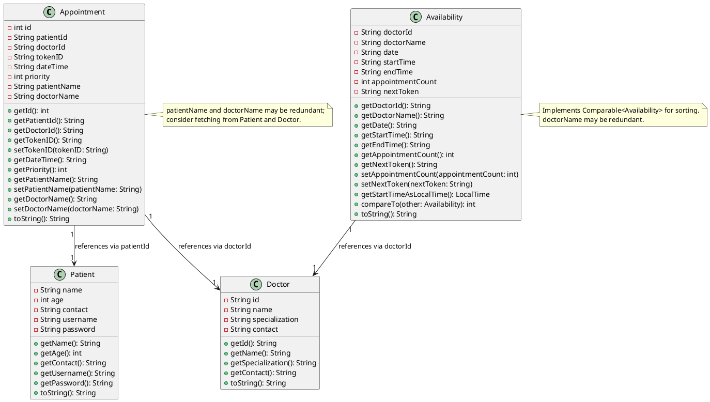
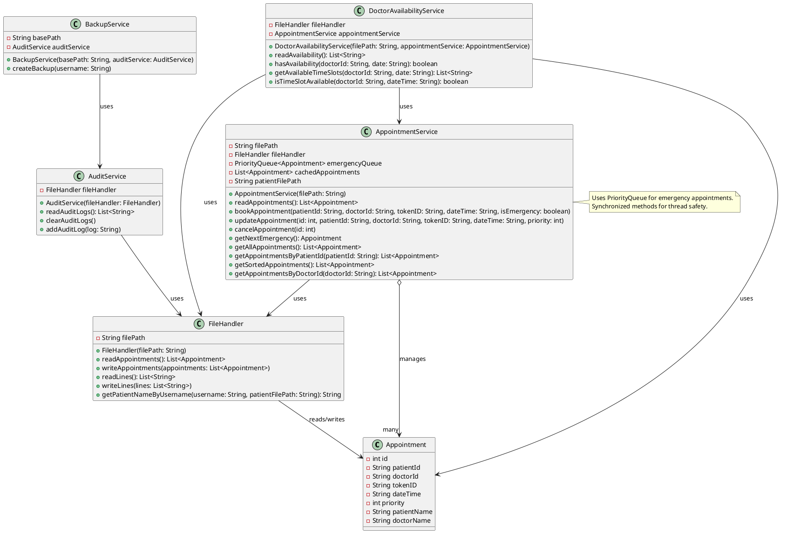

## OOP Implementation

The project emphasizes **OOP principles** across its layers:

### Model Layer
- **Availability**:
    - **Encapsulation**: Private fields with getters; selective setters.
    - **Abstraction**: Simplifies time slot management.
    - **Inheritance**: Implements `Comparable<Availability>` for sorting.
    - **Polymorphism**: Custom `compareTo` for availability sorting.
- **Appointment**, **Patient**, **Doctor**:
    - **Encapsulation**: Private fields with getters/setters.
    - **Abstraction**: Represents core entities.
    - **Inheritance**: Extends `Object`.
    - **Polymorphism**: Minimal usage.

### Service Layer
- **AuditService**, **BackupService**, **DoctorAvailabilityService**, **FileHandler**:
    - **Encapsulation**: Private fields and methods.
    - **Abstraction**: Handles specific business logic.
    - **Inheritance**: Extends `Object`.
    - **Polymorphism**: None.
- **AppointmentService**:
    - **Encapsulation**: Private fields for data management.
    - **Abstraction**: Manages appointment logic with sorting and prioritization.
    - **Inheritance**: Extends `Object`.
    - **Polymorphism**: Uses `PriorityQueue` for emergency handling.

### Controller Layer
- **Servlets** (e.g., `AdminServlet`, `UserServlet`, etc.):
    - **Encapsulation**: Private fields for services and handlers.
    - **Abstraction**: Manages HTTP request/response flow.
    - **Inheritance**: Extends `HttpServlet`.
    - **Polymorphism**: Limited to `Comparable` in `SortServlet`.

**Summary**: The system demonstrates strong encapsulation and abstraction, with inheritance primarily in controllers (`HttpServlet`) and limited polymorphism (`Comparable`, `PriorityQueue`).

---

## Class Diagrams

Visualize the system's structure using the following **PlantUML** diagrams:

### Model Package

### Service Package

### Controller Package

```plantuml
@startuml
' Service Classes (Referenced)
class AppointmentService {
  +bookAppointment(patientId: String, doctorId: String, tokenID: String, dateTime: String, isEmergency: boolean)
  +updateAppointment(id: int, patientId: String, doctorId: String, tokenID: String, dateTime: String, priority: int)
  +cancelAppointment(id: int)
  +getAllAppointments(): List<Appointment>
  +getAppointmentsByPatientId(patientId: String): List<Appointment>
  +getSortedAppointments(): List<Appointment>
  +getAppointmentsByDoctorId(doctorId: String): List<Appointment>
}

class DoctorAvailabilityService {
  +readAvailability(): List<String>
  +hasAvailability(doctorId: String, date: String): boolean
  +getAvailableTimeSlots(doctorId: String, date: String): List<String>
  +isTimeSlotAvailable(doctorId: String, dateTime: String): boolean
}

class AuditService {
  +readAuditLogs(): List<String>
  +clearAuditLogs()
  +addAuditLog(log: String)
}

class BackupService {
  +createBackup(username: String)
}

class FileHandler {
  +readAppointments(): List<Appointment>
  +writeAppointments(appointments: List<Appointment>)
  +readLines(): List<String>
  +writeLines(lines: List<String>)
  +getPatientNameByUsername(username: String, patientFilePath: String): String
}

' Controller Classes
class LoginServlet {
  +doPost(request: HttpServletRequest, response: HttpServletResponse)
  -validateCredentials(username: String, password: String, role: String, request: HttpServletRequest): boolean
}

class LogoutServlet {
  +doGet(request: HttpServletRequest, response: HttpServletResponse)
  +doPost(request: HttpServletRequest, response: HttpServletResponse)
}

class RegisterServlet {
  +doGet(request: HttpServletRequest, response: HttpServletResponse)
  +doPost(request: HttpServletRequest, response: HttpServletResponse)
  -sanitizeInput(input: String): String
}

class AdminServlet {
  -AppointmentService appointmentService
  -DoctorAvailabilityService availabilityService
  -FileHandler doctorFileHandler
  -FileHandler patientFileHandler
  +init()
  +doGet(request: HttpServletRequest, response: HttpServletResponse)
  +doPost(request: HttpServletRequest, response: HttpServletResponse)
}

class DoctorServlet {
  -AppointmentService appointmentService
  -DoctorAvailabilityService availabilityService
  -FileHandler doctorFileHandler
  +init()
  +doGet(request: HttpServletRequest, response: HttpServletResponse)
  +doPost(request: HttpServletRequest, response: HttpServletResponse)
  -getDoctorByUsername(username: String): Doctor
  -updateDoctorDetails(doctor: Doctor, password: String)
}

class UserServlet {
  -AppointmentService appointmentService
  -DoctorAvailabilityService availabilityService
  -FileHandler doctorFileHandler
  -FileHandler userFileHandler
  +init()
  +doGet(request: HttpServletRequest, response: HttpServletResponse)
  +doPost(request: HttpServletRequest, response: HttpServletResponse)
}

class ManageAppointmentsServlet {
  -AppointmentService appointmentService
  -DoctorAvailabilityService availabilityService
  -String doctorsFilePath
  -String patientsFilePath
  +init()
  +doGet(request: HttpServletRequest, response: HttpServletResponse)
  +doPost(request: HttpServletRequest, response: HttpServletResponse)
  -readUsers(filePath: String, isDoctor: boolean): List<User>
  -generateTokenID(): String
}

class ManagePatientsServlet {
  -FileHandler patientFileHandler
  +init()
  +doGet(request: HttpServletRequest, response: HttpServletResponse)
  +doPost(request: HttpServletRequest, response: HttpServletResponse)
}

class ManageDoctorsServlet {
  -FileHandler doctorFileHandler
  +init()
  +doGet(request: HttpServletRequest, response: HttpServletResponse)
  +doPost(request: HttpServletRequest, response: HttpServletResponse)
}

class DoctorScheduleServlet {
  -FileHandler availabilityFileHandler
  -FileHandler doctorFileHandler
  +init()
  +doGet(request: HttpServletRequest, response: HttpServletResponse)
  +doPost(request: HttpServletRequest, response: HttpServletResponse)
  -handleAdd(request: HttpServletRequest, availability: List<String>)
  -handleRemove(request: HttpServletRequest, availability: List<String>)
  -handleEdit(request: HttpServletRequest, availability: List<String>)
}

class DataManagementServlet {
  -AuditService auditService
  -BackupService backupService
  +init()
  +doGet(request: HttpServletRequest, response: HttpServletResponse)
  +doPost(request: HttpServletRequest, response: HttpServletResponse)
}

class SortServlet {
  -AppointmentService appointmentService
  +init()
  +doGet(request: HttpServletRequest, response: HttpServletResponse)
  -loadDoctorDetails(request: HttpServletRequest): Map<String, Doctor>
  -loadAvailabilities(request: HttpServletRequest, doctorDetails: Map<String, Doctor>): List<Availability>
}

' Inner Classes for UserServlet
class SuccessResponse {
  -boolean success
  -String message
  +SuccessResponse(success: boolean, message: String)
}

class ErrorResponse {
  -String error
  +ErrorResponse(error: String)
}

' Controller-Service Relationships
AdminServlet --> AppointmentService : uses
AdminServlet --> DoctorAvailabilityService : uses
AdminServlet --> FileHandler : uses
DoctorServlet --> AppointmentService : uses
DoctorServlet --> DoctorAvailabilityService : uses
DoctorServlet --> FileHandler : uses
UserServlet --> AppointmentService : uses
UserServlet --> DoctorAvailabilityService : uses
UserServlet --> FileHandler : uses
ManageAppointmentsServlet --> AppointmentService : uses
ManageAppointmentsServlet --> DoctorAvailabilityService : uses
ManagePatientsServlet --> FileHandler : uses
ManageDoctorsServlet --> FileHandler : uses
DoctorScheduleServlet --> FileHandler : uses
DataManagementServlet --> AuditService : uses
DataManagementServlet --> BackupService : uses
SortServlet --> AppointmentService : uses
LoginServlet --> FileHandler : uses
RegisterServlet --> FileHandler : uses

' Inner Class Relationships
UserServlet o--> SuccessResponse : contains
UserServlet o--> ErrorResponse : contains

@enduml
```

To render these diagrams, use a **PlantUML** tool (e.g., [PlantUML Web Server](http://www.plantuml.com/plantuml)).

---